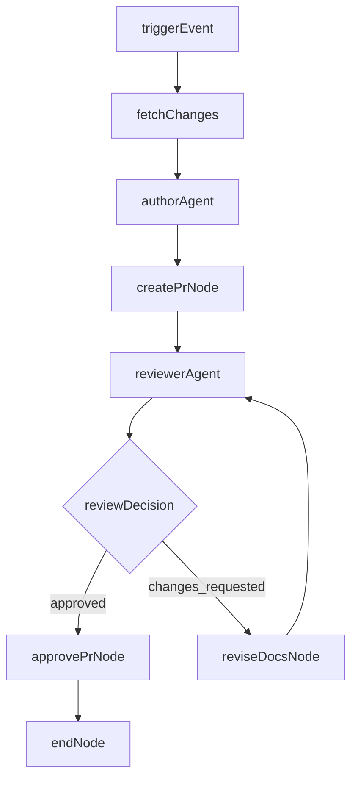

# docs-agent-ops

`docs-agent-ops` 是 MatrixOne 文档自动化流水线项目。它围绕“**证据驱动、双智能体协作、严格门禁、可审计落盘**”构建，在新版本发布时自动完成文档更新提议与审核闭环。

目标流程：

- `Diff/Release Notes` 取证
- Author 生成文档补丁与 claims
- 创建 PR
- Reviewer 独立校验并提出修订
- 进入修订回路直至通过
- 自动 approve（**人工最终 merge**）

## 设计原则

- 仅允许基于证据生成内容，禁止无依据外推
- 每条文档改动必须可追溯到 `code_path + reason`
- Reviewer 与 Author 独立决策，失败必须阻断
- 关键状态与产物全部文件化落盘，支持审计复盘

## 核心能力

- **LangGraph 编排**
  - 使用 `StateGraph` 实现有状态节点流转与条件回路
- **双智能体插件化**
  - Author / Reviewer 通过统一插件契约接入
  - 支持 deterministic fallback 与 MCP 外部 Agent
- **多模型路由**
  - 按角色配置 provider/model/temperature/fallback
- **质量门禁**
  - 支持 pre-PR 与 post-review 双阶段门禁判定
  - 门禁规则来源于 `configs/quality_gates.yaml`
- **可观测与报表**
  - 单次运行指标 + 历史聚合 + 周报输出

## 架构总览

- `app/graph/`
  - `state.py`：工作流状态模型
  - `langgraph_workflow.py`：节点与条件边编排
  - `workflow.py`：CLI 入口与兼容封装
- `app/agents/`
  - `base.py`：插件输入输出协议
  - `registry.py`：插件构造与实现绑定
  - `router.py`：Author/Reviewer 调度
- `app/connectors/`
  - `matrixone_evidence.py`：Diff 与证据采集
  - `docs_repo_sync.py`：文档仓同步
  - `github_pr.py`：PR 创建、更新、审批
  - `mcp_agent_client.py`：MCP 外部 Agent 调用
  - `model_router.py`：模型路由
- `app/skills/`
  - `mo_doc_writer.py` / `mo_doc_reviewer.py`：deterministic fallback + prompt 适配
- `app/core/`
  - `settings.py`：配置加载
  - `run_state.py`：运行状态与幂等控制
  - `quality_gate.py`：门禁判定
  - `phase7_metrics.py`：指标构建与聚合
- `configs/`
  - `path_mapping.yaml`：代码路径到文档路径映射
  - `agents.yaml`：插件与回路上限
  - `models.yaml`：角色模型路由
  - `prompts.yaml`：提示词模板
  - `quality_gates.yaml`：门禁开关与级别
- `scripts/generate_metrics_report.py`
  - 生成灰度统计报告

## 工作流状态机

节点链路：

- `fetch_changes`
- `analyze_and_generate`
- `create_pr`
- `review_pr`
- `revise_docs`（可循环）
- `approve_pr`

流程图：



当前实现边界（重要）：

- 当前 evidence bundle 在默认实现中主要包含 `commits`、`changed_files`、`retrieval_scope`
- `release_notes` / `diff_content` 字段在未启用增强采集前可能为空或摘要化内容
- 因此建议先在 dry-run 校验证据质量，再启用真实 PR 模式

## 环境要求

- Python `3.11.x`
- Git / `gh` CLI（真实 PR 模式）
- Docker + Docker Compose（可选）

## 本地快速开始

1) 初始化开发环境

```bash
./scripts/setup_dev.sh
source .venv/bin/activate
```

2) 服务健康检查

```bash
python3 -m app.main
curl http://127.0.0.1:8080/healthz
```

3) 执行一次 dry-run 流水线

```bash
python3 -m app.graph.workflow \
  --prev-tag v0.9.0 \
  --new-tag v0.9.1 \
  --trigger-source manual \
  --dry-run
```

4) 运行质量检查与测试

```bash
ruff check app tests scripts
pytest -q
```

## 真实运行（非 dry-run）

仅在你已完成 token、仓库权限、分支策略校验后启用：

```bash
python3 -m app.graph.workflow \
  --prev-tag v0.9.0 \
  --new-tag v0.9.1 \
  --trigger-source workflow_dispatch \
  --no-dry-run
```

注意：

- 非 dry-run 会执行真实 `git` 与 `gh pr create`
- Reviewer 通过后仅自动 `approve`，不会自动 merge

## 配置说明

先复制：

```bash
cp .env.example .env
```

关键环境变量：

- `APP_ENV`：运行环境，默认 `dev`
- `RUNS_DIR`：运行产物目录，默认 `./runs`
- `MATRIXONE_REPO_DIR`：本地 matrixone 仓路径
- `DOCS_REPO_DIR`：本地 docs 仓路径
- `MATRIXONE_REPO`：matrixone 远程地址
- `MATRIXORIGIN_DOCS_REPO`：docs 远程地址（建议使用 HTTPS，例如 `https://github.com/owner/repo.git`）
- `PATH_MAPPING_FILE`：路径映射配置路径
- `AGENTS_CONFIG_PATH`：插件配置路径
- `MODELS_CONFIG_PATH`：模型路由配置路径
- `PROMPTS_CONFIG_PATH`：提示词配置路径
- `QUALITY_GATES_CONFIG_PATH`：门禁配置路径
- `MCP_AUTHOR_ENDPOINT`：Author MCP 服务地址（可覆盖 `configs/agents.yaml`）
- `MCP_REVIEWER_ENDPOINT`：Reviewer MCP 服务地址（可覆盖 `configs/agents.yaml`）
- `ANTHROPIC_BASE_URL`：Anthropic 兼容 API 基础地址（例如 MiniMax）
- `DOCS_REPO_TOKEN`：建议优先配置，目标 docs 仓写权限
- `OPENAI_API_KEY`：OpenAI provider 密钥（可选）
- `ANTHROPIC_API_KEY`：Anthropic provider 密钥（可选）

## 配置文件约定

- `configs/agents.yaml`
  - 选择 `author_plugin` / `reviewer_plugin`
  - 配置 `max_revision_loops`
  - 可切换 deterministic 与 MCP 插件
- `configs/models.yaml`
  - 按 `author` / `reviewer` 配置模型策略
  - 支持 fallback provider/model
- `configs/prompts.yaml`
  - 角色级系统提示词
  - 建议保留“仅基于证据”的硬约束文本
- `configs/quality_gates.yaml`
  - 门禁 ID 与级别配置
  - 实际执行由 `quality_gate.py` 读取并判定

## MCP 外部 Agent 接入规范

启用 `mcp_author` / `mcp_reviewer` 时，endpoint 返回结构必须满足：

- Author 输出：
  - `doc_patch_diff`
  - `change_summary_md`
  - `claims`
  - `evidence_map`
- Reviewer 输出：
  - `decision`
  - `comments`
  - `blocking_issues`
  - `review_report`
  - `verification_map`

推荐做法：

- 先用 deterministic 路径打通，再切换到 MCP
- 在 staging 环境验证 schema 稳定性后再上线

## 本地 MCP 服务（已内置）

项目已内置本地网关：`app/mcp_gateway/server.py`，提供：

- `GET /healthz`：服务健康状态
- `POST /invoke`：统一 Author/Reviewer 调用入口

启动命令：

```bash
python3 -m uvicorn app.mcp_gateway.server:app --host 127.0.0.1 --port 8787
```

建议配置：

- `.env` 中将 `MCP_AUTHOR_ENDPOINT`、`MCP_REVIEWER_ENDPOINT` 设为 `http://127.0.0.1:8787/invoke`
- `ANTHROPIC_BASE_URL` 使用 MiniMax Anthropic 兼容地址
- `ANTHROPIC_API_KEY` 使用你的 MiniMax key
- 本地联调可设 `MCP_GATEWAY_MOCK=true`（不调用外部模型）

## 运行产物与审计

每次运行输出到 `runs/<run_id>/`（可能因分支略有差异）：

- `run_state.json`：阶段状态、决策、产物索引
- `pipeline.log`：节点级流水日志
- `evidence_bundle.json`：证据集合
- `doc_patch.diff`：文档补丁
- `change_summary.md`：摘要
- `claims.json`：变更主张与证据映射
- `review_report.json`：审核结果
- `pr_payload.json`：PR payload（进入 create_pr 时）
- `run_metrics.json`：单次指标

## 指标与周报

指标链路：

- 每次运行追加到 `runs/metrics_history.jsonl`
- 周报脚本汇总并输出 `runs/phase7_report.json`

命令：

```bash
python scripts/generate_metrics_report.py
```

## GitHub Actions

主要工作流：

- `.github/workflows/pipeline-langgraph.yml`
  - 支持 `workflow_dispatch` 与 `tag push`
  - 支持 `dry_run` 开关
  - 上传 `runs/` 产物
- `.github/workflows/dev-sanity.yml`
  - `ruff + pytest + docker healthcheck`

## CI/CD 前置检查建议

- `ruff check app tests scripts`
- `pytest -q`
- 验证 `configs/*` 与 `.env.example` 一致性
- 验证 docs 仓权限与 `DOCS_REPO_TOKEN` 有效性

## 你需要填写的最终配置清单

GitHub Repository Variables：

- `MATRIXONE_REPO`
- `MATRIXONE_REPO_DIR`
- `MATRIXORIGIN_DOCS_REPO`
- `DOCS_REPO_DIR`

GitHub Secrets：

- `DOCS_REPO_TOKEN`（推荐）
- `OPENAI_API_KEY`（若使用 OpenAI）
- `ANTHROPIC_API_KEY`（若使用 Anthropic）

本地/CI 配置文件：

- `configs/agents.yaml`
- `configs/models.yaml`
- `configs/prompts.yaml`
- `configs/quality_gates.yaml`

## 常见问题

- `dry_run=false` 失败
  - 优先检查 token、远端推送权限、`DOCS_REPO_DIR` 指向是否正确
- PR 创建成功但评审回路失败
  - 检查 reviewer 输出 schema 与 `claims` 对齐
- 指标为空
  - 至少执行一次完整流水线后再生成周报
- 本地仓状态异常
  - 清理本地目标目录后重试，并重新校验 remote URL
